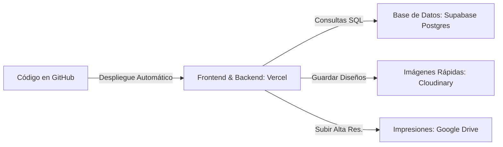

# Plan de Despliegue, Hosting e Infraestructura (Costo Inicial S/ 0)

Para un proyecto que está iniciando, una mala decisión de servidores puede consumir tu presupuesto mensual. Como arquitecto de software, he diseñado una infraestructura basada en la nube con **capas gratuitas ultra generosas** para que el costo de mantenimiento mensual de tu web sea de **S/ 0** (cero soles/dólares) al inicio, pagando únicamente por tu dominio propio.

A continuación, se detalla dónde se hospedará cada parte del sistema y cómo se automatizará el despliegue.

---

## 1. Mapa de Infraestructura en la Nube

### Proveedores Seleccionados:

1.  **Código Fuente (Control de Versiones): [GitHub](https://github.com/)**
    *   *Servicio:* Repositorio privado para resguardar nuestro código de forma segura.
    *   *Costo:* **Gratis**.
2.  **Servidor Web y APIs: [Vercel](https://vercel.com/)**
    *   *Servicio:* Es la plataforma oficial creada por los mismos desarrolladores de Next.js. Soporta escalamiento global automático y HTTPS (certificado SSL de candado seguro) de forma gratuita e instantánea.
    *   *Costo:* **Gratis** (Capa Hobby, más que suficiente para miles de visitas diarias).
3.  **Base de Datos PostgreSQL: [Supabase](https://supabase.com/) o [Neon](https://neon.tech/)**
    *   *Servicio:* Proveedores líderes de PostgreSQL en la nube optimizados para Next.js. Ofrecen copias de seguridad automatizadas y herramientas visuales para ver las tablas.
    *   *Costo:* **Gratis** (Capa gratuita incluye 500 MB de base de datos, lo que equivale a almacenar información de más de 100,000 pedidos).
    *   *Estrategia de Desarrollo:* 
        *   **Opción A (Recomendada): Conectarse directamente a una base de datos de Desarrollo (Dev DB) en la nube (Supabase).** Esto elimina la necesidad de instalar Docker Desktop en tu computadora, ahorrando memoria RAM y tiempo de configuración.
        *   **Opción B (Alternativa local): Usar un contenedor Docker de PostgreSQL.** Excelente si prefieres trabajar 100% offline, pero requiere que tengas Docker Desktop instalado y virtualización activa en tu BIOS.
4.  **Dominio Propio (El único pago obligatorio):**
    *   *Recomendación:* Comprar un dominio `.com` (en Namecheap/GoDaddy por aprox. S/ 40 a S/ 55 al año) o un dominio `.pe` / `.com.pe` (en Punto.pe por S/ 110 al año).
    *   *Integración:* Vercel nos permite conectar el dominio de forma gratuita en 2 minutos.

---

## 2. Flujo de Despliegue Continuo (CI/CD)

No usaremos transferencias de archivos manuales y lentas por FTP (como se hacía antiguamente). Todo será automatizado:

1.  **Desarrollo:** Trabajamos y probamos la web de forma local en tu computadora.
2.  **Commit a Git:** Guardamos los cambios y los subimos a nuestro repositorio privado de **GitHub** (`git push`).
3.  **Despliegue Automático:** **Vercel** detecta el nuevo código en GitHub, compila la web automáticamente, ejecuta las validaciones y actualiza la tienda en producción en menos de 2 minutos sin interrumpir las visitas de los usuarios.

