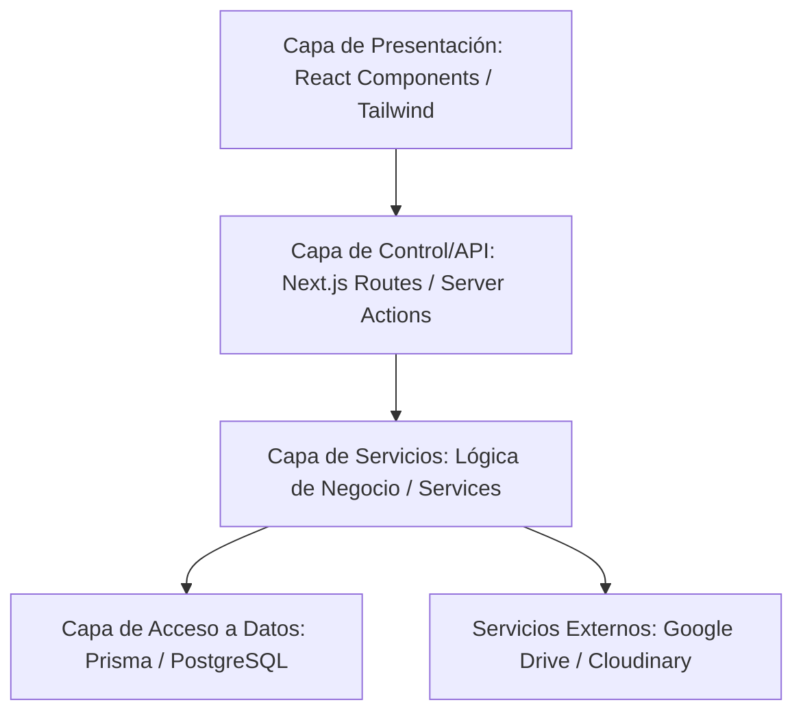

# Metodología de Desarrollo y Patrones de Diseño de Software

Para asegurar que nuestro e-commerce sea robusto, fácil de mantener por otros programadores en el futuro y capaz de escalar sin problemas, seguiremos rigurosos estándares de ingeniería de software. 

A continuación, se detalla la metodología, los principios de *Clean Code*, la arquitectura y los patrones de diseño que implementaremos en el código.

---

## 1. Arquitectura de Software: Monolito Modular en Capas
Organizaremos el código separando las responsabilidades de forma estricta. Una capa no debe realizar tareas que corresponden a otra.

### Las Capas del Proyecto:
1.  **Capa de Presentación (Frontend):** (`src/app/` y `src/components/`). Solo maneja la visualización de datos, estilos y captura de eventos del usuario. No sabe nada de SQL ni de contraseñas de Google Drive.
2.  **Capa de Aplicación / Controladores (API):** (`src/app/api/` y Server Actions). Valida la entrada del usuario usando **Zod**, llama a la capa de servicios y responde en formato JSON o HTML. No contiene lógica de negocio compleja ni consultas directas a base de datos.
3.  **Capa de Dominio / Servicios (Lógica pura):** (`src/services/`). Es el cerebro de la aplicación. Aquí se definen las reglas: cómo calcular el precio con descuento, cuándo un pedido pasa a estar "En horno", o qué datos enviar a Google Drive.
4.  **Capa de Infraestructura / Datos:** (`src/lib/` y Prisma). Encargada de comunicarse de manera segura con PostgreSQL y APIs de terceros.

---

## 2. Principios de Clean Code (Código Limpio)
Aplicaremos buenas prácticas de programación recomendadas por Robert C. Martin (*Clean Code*):

*   **Responsabilidad Única (SRP):** Cada función o componente debe hacer **una sola cosa** y hacerla bien. Por ejemplo: la función `crearPedido()` se encarga de registrarlo en la base de datos, no de subir el PDF a Drive. Para subir a Drive llamará a la función `subirArchivoADrive()`.
*   **DRY (Don't Repeat Yourself - No te repitas):** Si un cálculo o elemento visual se repite más de dos veces, se extrae a una función utilitaria en `src/lib/utils.ts` o a un componente de React reutilizable.
*   **Nombres Descriptivos e Idioma:**
    *   Toda la **interfaz de usuario** y **documentación** se maneja en **Español**.
    *   El **código fuente** (nombres de variables, funciones, bases de datos y TypeScript) se escribirá en **Inglés** (ej. `orderService.createOrder()`, `isCustomizable`, `totalAmount`). Esto es el estándar de la industria que facilita el mantenimiento por otros desarrolladores a nivel global.
    *   Los nombres de variables deben ser descriptivos: preferir `discountedPrice` sobre `dp` o `precio`.

---

## 3. Patrones de Diseño a Implementar

### **A. Patrón Singleton (Instancia Única)**
*   **Dónde se usa:** En el cliente de base de datos (`src/lib/db.ts`).
*   **Por qué:** Next.js, en desarrollo, recarga las páginas constantemente (Hot Reloading). Si no usamos un Singleton, cada recarga creará una nueva conexión a PostgreSQL, saturando la base de datos en pocos minutos. Este patrón asegura que haya **una sola conexión activa** en toda la aplicación.

### **B. Patrón Service (Servicios de Dominio)**
*   **Dónde se usa:** En toda la lógica de negocio (`src/services/*`).
*   **Por qué:** Agrupa las consultas de base de datos e integraciones en módulos dedicados. De esta forma, si el catálogo de productos es consultado por la web de Next.js o por la futura app de Flutter, ambos usarán exactamente el mismo servicio: `ProductService.getProducts()`.

### **C. Patrón Adapter / Interface (Flexibilidad de Proveedores)**
*   **Dónde se usa:** En los servicios de subida de archivos (Cloudinary vs. AWS S3) y pasarelas de pago.
*   **Por qué:** Crearemos una interface común (ej. `StorageProvider`). Si el día de mañana decides migrar de Cloudinary a AWS S3, no tendremos que cambiar el código de toda la aplicación; solo cambiaremos el "adaptador" de almacenamiento sin romper la web.

---

## 4. Escalabilidad y Rendimiento (Pensando en el Futuro)

### **A. Generación Estática Incremental (ISR) para el Catálogo**
*   Consultar la base de datos cada vez que un usuario entra al catálogo web es ineficiente si tienes miles de visitas. 
*   Next.js nos permite generar las páginas de productos de forma estática en el servidor y actualizarlas en segundo plano cada (ejemplo) 60 segundos. La base de datos descansará y la web cargará en milisegundos.

### **B. Indexación de Base de Datos en Postgres**
*   Crearemos índices en columnas de búsqueda frecuentes en PostgreSQL (como `sku`, `email` del usuario, y `status` del pedido) para que las consultas sigan respondiendo en milisegundos incluso cuando la base de datos tenga miles de registros de ventas.

---

## 5. Gestor de Paquetes: npm (Node Package Manager)
Como estándar para la gestión de dependencias y ejecución de scripts, utilizaremos **npm** (la herramienta por defecto de Node.js).

*   **¿Por qué npm?**
    *   **Compatibilidad y Estabilidad en Windows:** pnpm utiliza un sistema de enlaces simbólicos (symlinks) y copias de archivos optimizadas desde un almacén global. En sistemas Windows, el Antivirus (Windows Defender) o directivas locales de seguridad suelen bloquear estos enlaces en archivos binarios grandes (como los motores de Prisma), provocando fallos de instalación. `npm` descarga y extrae los archivos de forma plana y directa, evitando bloqueos y garantizando un entorno 100% estable en tu máquina.
*   **Comandos Oficiales:**
    *   Instalación de paquetes: `npm install <nombre>` (o `npm install -D <nombre>` para desarrollo)
    *   Desarrollo local: `npm run dev`
    *   Generación de compilación: `npm run build`
    *   Ejecución de base de datos Prisma: `npx prisma db push` o `npx prisma migrate dev`
