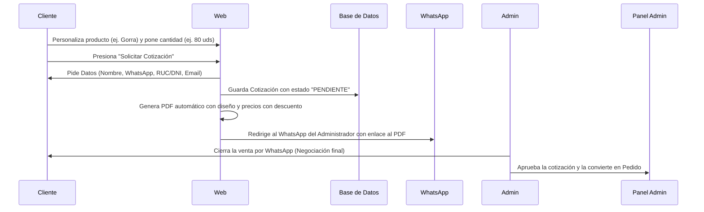

# Flujo de Notificaciones y Cotizaciones (WhatsApp + Web)

En el mercado latinoamericano, WhatsApp es la herramienta de comunicación con mayor efectividad (más del 95% de tasa de apertura). Integrarlo con nuestra web de Next.js nos dará una tasa de conversión de ventas mucho más alta y mantendrá a los clientes felices.

Aquí detallamos cómo funcionarán las notificaciones de estado y el sistema de cotizaciones.

---

## 1. Sistema de Notificaciones de Pedido

Para mantener al cliente informado y reducir su ansiedad, combinaremos la consulta en la web con avisos automatizados:

### **A. Seguimiento en la Web (El Tracker)**
*   Cada pedido tiene una URL única de seguimiento (ej. `tutienda.com/pedidos/1024`).
*   Muestra de forma visual e interactiva el estado del producto (💳 *Pago verificado*, 🎨 *Diseño listo*, 🔥 *En prensa*, 🚚 *Enviado*).

### **B. Notificaciones por WhatsApp**
Implementaremos esto en dos fases según el presupuesto y volumen de ventas:

*   **Fase 1 (Semicolaborativa - Gratis):**
    *   En tu Panel de Administración, al cambiar el estado de un pedido (por ejemplo, a "Listo para entrega"), el sistema mostrará un botón: **"Notificar por WhatsApp"**.
    *   Al hacer clic, se abrirá WhatsApp Web o la App con un chat directo al cliente y un mensaje pre-redactado automáticamente:
        > *"¡Hola Juan! 👋 Tu pedido #1024 de Taza Personalizada ya está en el horno de sublimación. Puedes seguir el proceso aquí: tutienda.com/pedidos/1024"*
    *   Solo debes presionar "Enviar". Es 100% gratis y no requiere pagar APIs.
*   **Fase 2 (100% Automatizada - Con API):**
    *   Integramos la API oficial de WhatsApp Cloud o proveedores económicos (como Twilio, Wati o Baileys).
    *   Cuando cambies el estado en el panel de control, el servidor enviará el mensaje de WhatsApp de forma automática en segundo plano, sin que tengas que abrir WhatsApp manualmente. (Requiere un costo mínimo por mensaje, de fracciones de centavo).

### **C. Notificaciones por Correo Electrónico (Email Transaccional)**
*   Usaremos **Resend** (proveedor moderno y rápido para Next.js con plantilla en React Email) para enviar correos automáticos al cliente:
    1.  Al crear el pedido (Resumen de compra y datos de pago).
    2.  Al confirmar el pago (Boleta/Factura digital).
    3.  Al enviar el producto (Código de seguimiento de la courier).

---

## 2. Sistema de Cotizaciones (Para Ventas Corporativas o por Mayor)

Muchos clientes corporativos, colegios o empresas quieren comprar al por mayor (ej. 100 tazas para fin de año) pero necesitan una cotización formal firmada antes de pagar.

### **El Flujo de Cotización Inteligente en la Web:**

### **Detalles del Flujo:**

1.  **Diseño y Selección:** El cliente corporativo entra al customizador en la web, sube el logo de su empresa, ajusta la posición en el producto y escribe la cantidad deseada (ej. 50 unidades).
2.  **Solicitud:** En vez de presionar "Comprar", presiona **"Solicitar Cotización por Mayor"**.
3.  **Captura de Leads:** La web le solicita sus datos de contacto y facturación (Nombre, WhatsApp, Email, RUC/DNI).
4.  **Generación de PDF:** El sistema de Next.js genera un archivo PDF formal automáticamente con:
    *   Imagen de cómo quedó el producto personalizado.
    *   Desglose de precios (aplicando descuentos automáticos por volumen).
    *   Términos y condiciones de entrega.
5.  **Enlace por WhatsApp:** La web redirige al usuario a tu WhatsApp con un mensaje predeterminado:
    > *"Hola, solicité una cotización para 50 tazas con logo. Aquí está mi cotización: tutienda.com/cotizacion/COT-782"*
6.  **Cierre de Venta:** Tú recibes el mensaje en WhatsApp, revisas el PDF generado por la web y hablas directamente con el cliente para concretar la entrega, métodos de pago y cerrar el trato con calidez humana.
7.  **Conversión:** En tu panel de administración, cambias el estado de la cotización `COT-782` a "Aprobada" y se convierte automáticamente en un pedido en producción.

---

## 3. Flujo Logístico: Entrega a Domicilio vs. Retiro en Taller

Como administrador que gestiona la logística directamente, la web ofrecerá dos opciones claras al momento de finalizar la compra (checkout):

### **Opción A: Envío a Domicilio (Gestionado por ti)**
*   **Para pedidos minoristas:** Ideal para envíos locales en moto. El cliente selecciona su distrito y la web calcula dinámicamente el costo de envío (ej. tarifa plana por zonas o envío gratis a partir de cierto monto, ej. S/ 150).
*   **Para pedidos mayoristas (Al por mayor):** Si el cliente requiere envío a domicilio de un pedido grande (ej. 100 tazas que pesan aprox. 40 kg), el costo de envío no se cobra directamente en la web. El sistema le mostrará un aviso: *"Para pedidos al por mayor, el costo y método de envío se coordinarán directamente por WhatsApp después de confirmar la orden."*

### **Opción B: Retiro en Taller (Costo S/ 0.00) - Altamente Recomendado para Mayoristas**
*   El cliente selecciona **"Retiro en Taller/Establecimiento"**.
*   **La web le muestra:** La dirección de tu taller físico, horarios de atención y un mapa integrado (Google Maps).
*   **Coordinación de recogida:** Al confirmar la orden, el cliente recibe en su WhatsApp un enlace para agendar el día y la hora de recogida (para evitar que vayan cuando no estás o cuando el pedido no está listo).
*   **Beneficio comercial (Trust Building):** El retiro en taller para clientes de volumen genera una enorme confianza. Al ir a tu taller, ven tus máquinas de sublimación, comprueban tu seriedad y calidad, lo que suele traducirse en relaciones comerciales a largo plazo y más pedidos repetitivos.
