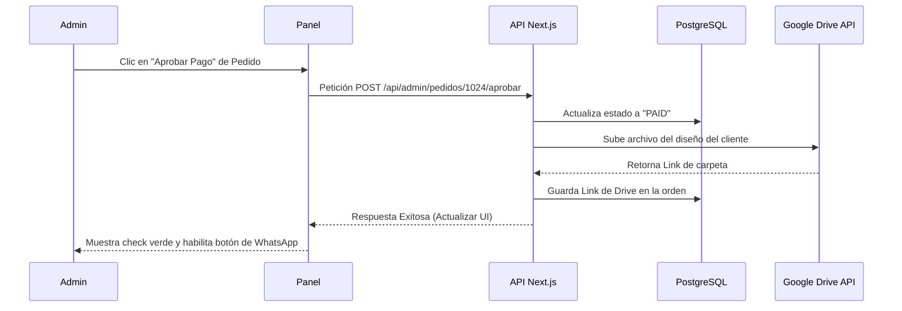

# Especificación del Panel Administrativo (Backoffice)

El **Panel Administrativo** es una sección privada y segura dentro de la misma aplicación web de Next.js (ruta protegida `/admin/*`). Se conecta directamente a la base de datos PostgreSQL para permitirte gestionar ventas, productos, clientes y la logística del taller de sublimación.

A continuación se detalla cómo funcionará y qué pantallas tendrá este panel.

---

## 1. Seguridad y Acceso al Panel
*   **Ruta Privada:** Solo accesible ingresando a `tutienda.com/admin`.
*   **Protección por Middleware:** Si un cliente común intenta entrar a esta ruta, el servidor detecta que no tiene el rol de `ADMIN` y lo redirige automáticamente al login de usuario.
*   **Diseño de la Interfaz:** Utilizaremos componentes oscuros/claros premium basados en **Tailwind CSS** y **shadcn/ui** (tablas interactivas, gráficos de ventas y modales limpios).

---

## 2. Pantallas del Panel Administrativo

### **Pantalla A: Dashboard / Panel de Control (`/admin/dashboard`)**
Es la pantalla de inicio del administrador. Te da un resumen del estado del negocio en tiempo real.
*   **Tarjetas de Estadísticas:**
    *   💰 *Ventas Totales:* Dinero facturado acumulado.
    *   📦 *Pedidos Activos:* Cantidad de pedidos en proceso de impresión o entrega.
    *   📊 *Tasa de Conversión:* Cuánta gente entra a la web frente a los que compran.
*   **Gráfica de Ventas:** Historial mensual o semanal de ingresos.
*   **Lista de Actividad Reciente:** Los últimos pedidos recibidos pendientes de revisión de pago.

### **Pantalla B: Gestor de Pedidos (`/admin/pedidos`)**
La pantalla más importante para el flujo de trabajo diario de tu taller.
*   **Tabla de Órdenes:** Lista interactiva ordenada por fecha que muestra: *ID de Pedido*, *Cliente*, *WhatsApp*, *Total (S/)*, *Estado de Producción* y *Tipo de Entrega (Envío o Retiro)*.
*   **Modal de Detalle de Pedido (Detalle al hacer clic):**
    *   **Visor de Voucher (Yape/Plin):** Muestra la imagen de la captura de pantalla que subió el cliente para que confirmes que el dinero está en tu cuenta.
    *   **Botón [Aprobar Pago]:** Con un solo clic valida el pago, cambia el estado a "Pago Aprobado" y **activa la subida automática del diseño original del cliente a tu carpeta de Google Drive**.
    *   **Enlace de Descarga Directa:** Link para descargar el archivo del diseño en alta resolución para sublimar en caso quieras descargarlo directamente sin entrar a Drive.
    *   **Control del Estado de Producción:** Selector para cambiar el estado del pedido:
        *   `PAGO_VERIFICADO` -> `EN_PRODUCCION` -> `LISTO_ENTREGA` -> `ENTREGADO`
    *   **Botón [Notificar por WhatsApp]:** Abre una ventana de WhatsApp Web al número del cliente con el mensaje de estado correspondiente pre-redactado.

### **Pantalla C: Gestor de Catálogo (`/admin/productos`)**
Para actualizar tu tienda sin necesidad de tocar código.
*   **Lista de Productos:** Tabla con los productos existentes, su categoría y cantidad de stock.
*   **Formulario de Nuevo Producto / Edición:**
    *   Campos: Nombre, descripción, categoría, precio base y si es personalizable (tazas) o estático.
    *   **Gestor de Variantes:** Añadir variantes de colores, tallas y stock correspondiente (ej. Camiseta Negra Talla M - Stock: 15).
    *   Carga de imágenes del producto para el catálogo.

### **Pantalla D: Base de Datos de Clientes (`/admin/clientes`)**
*   Directorio con el historial de clientes, sus correos, teléfonos de contacto y total de compras realizadas. Ideal para hacer campañas de fidelización por WhatsApp.

---

## 3. Flujo de Datos del Panel (Backend en Next.js)

