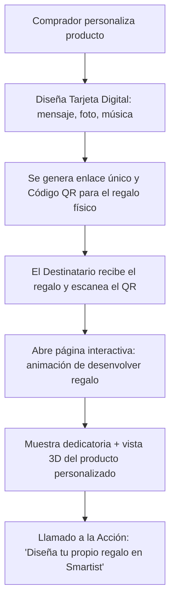

# Propuesta de Atracción y Viralidad: Dedicatoria Digital Interactiva y Generador de Patrones

Para atraer consumidores de forma orgánica y viral hacia **Smartist**, proponemos implementar una función de **"Dedicatoria Digital Interactiva con Envoltura Virtual"**. Esto permite que el comprador de un regalo cree una experiencia digital única para el destinatario, quien al abrir su regalo recibirá un enlace web que lo redirigirá a nuestra plataforma, exponiéndolo a nuestros beneficios y motivándolo a crear su propio regalo.

A continuación, detallamos tres propuestas estratégicas diseñadas para generar impacto emocional, tracción de visitas y conversión de ventas.

---

## Propuesta 1: La Tarjeta de Dedicatoria Digital Interactiva (Experiencia Emocional)
*La idea principal es que cada regalo físico (taza, prenda, etc.) venga acompañado de un código QR o enlace único que abre una experiencia digital interactiva de "desenvoltura" y dedicatoria.*

### 1. El Flujo de Experiencia del Usuario (UX)


### 2. Características Clave
* **Efecto de Desvelado (Unboxing Virtual):** Al abrir el enlace, el destinatario ve una caja de regalo en 3D que vibra. Al hacer clic, se reproduce una animación premium de confeti y papel de regalo abriéndose.
* **Dedicatoria Personalizada:** Muestra un mensaje con fuentes elegantes (cursivas o modernas), una foto cargada por el remitente, y un reproductor de música integrado (ej. widget de Spotify con la canción dedicada).
* **Previsualización del Producto:** Muestra el renderizado interactivo en 3D del producto que tiene en las manos, destacando el valor del diseño exclusivo.
* **Gancho de Atracción (Viral Loop):** Al final de la página, se muestra un banner llamativo y premium: 
  > *¿Te encantó este detalle personalizado? Sorprende a alguien especial diseñando tu propio regalo con nuestro visualizador 3D en tiempo real.*
  > `[Diseñar un Regalo Ahora]`

---

## Propuesta 2: El Generador de Patrones de Papel de Regalo Personalizados
*Una herramienta gratuita en nuestra web que permite a cualquier usuario diseñar su propio patrón de papel de regalo (seamless background pattern) usando fotos de rostros, mascotas, o iconos prediseñados.*

### 1. ¿Cómo funciona la herramienta?
1. El usuario entra a `smartist.pe/patrones` o hace clic en un banner del catálogo.
2. Sube una foto (ej. la cara de su novio/a o de su perro) y la IA recorta automáticamente el fondo (o el usuario elige iconos prediseñados).
3. Selecciona un color de fondo (degradados elegantes, colores pastel o modo oscuro) y un estilo de distribución (en diagonal, cuadrícula, disperso).
4. El sistema genera instantáneamente un **patrón repetitivo (papel de regalo digital)**.

### 2. La Atracción y el Modelo de Negocio
* **Descarga Digital Gratis (a cambio de registro):** El usuario puede descargar el patrón digital para usarlo en redes sociales o imprimirlo en casa ingresando su correo electrónico (captación de leads).
* **Impresión Física Smartist:** Ofrecemos la opción de imprimir el patrón físicamente en papel de alta calidad por un costo adicional, o añadirlo como la envoltura oficial del producto personalizado que está comprando en el carrito de compras.

---

## Propuesta 3: Mensajes y Poemas Asistidos por IA (Generador de Dedicatorias)
*Muchos clientes quieren regalar algo especial pero no encuentran las palabras correctas. Añadiremos un "Asistente de Dedicatorias con IA" dentro del flujo de creación.*

### 1. Funcionamiento
* El usuario selecciona la ocasión (Aniversario, Cumpleaños, Graduación, Condolencias, Amor a Distancia).
* Indica el tono (Divertido, Romántico, Poético, Corto y Directo) y un par de detalles clave (ej. *"Se llama Sofía y le gustan los gatos"*).
* La IA genera tres propuestas de dedicatorias hermosas y emotivas en segundos.

### 2. Integración
* Este texto generado se puede copiar directamente al campo de dedicatoria de la **Propuesta 1**, cerrando el círculo de experiencia de usuario sin fricciones.

---

## Beneficios para Smartist

1. **Tráfico Calificado Orgánico:** Cada destinatario que escanea el código QR en su regalo físico se convierte en un visitante potencial de la web.
2. **Publicidad Emocional:** La marca Smartist se asocia directamente con la emoción y la sorpresa de recibir un regalo personalizado.
3. **Diferenciador Competitivo:** Ninguna otra tienda de sublimación local ofrece una experiencia digital que complemente el regalo físico.
4. **Base de Datos de Leads:** Captura correos electrónicos de remitentes y destinatarios (con opción de consentimiento de marketing) para campañas de correo (Newsletters de San Valentín, Día de la Madre, Navidad, etc.).

---

## Plan de Implementación Técnica Propuesto

### Fase 1: Base de Datos & Backend
* Crear el modelo `Dedicatoria` en Prisma:
```prisma
model Dedicatoria {
  id          String   @id @default(uuid())
  orderId     String?  @unique
  remitente   String
  destinatario String
  mensaje     String   @db.Text
  imagenUrl   String?
  spotifyUri  String?
  patronKey   String   @default("corazones")
  createdAt   DateTime @default(now())
}
```
* Crear la API `/api/dedicatorias` (POST para guardar, GET público para visualizar).

### Fase 2: Interfaz Pública de la Dedicatoria (`/regalo/[id]`)
* Página interactiva optimizada para móviles (90% de los accesos serán desde el celular tras escanear el QR).
* Animación CSS/Framer Motion para abrir la caja de regalo.
* Integración con el visualizador 3D del producto asociado.
* Banner final con el enlace de llamada a la acción para comprar o personalizar.

### Fase 3: Integración en el Checkout
* Añadir un checkbox en el proceso de compra: `[x] Añadir dedicatoria digital interactiva gratis (Código QR en el empaque)`.
* Al marcarlo, se abre un modal sencillo para llenar los datos.
* Al procesarse el pedido, el administrador del taller imprime una tarjeta de presentación con el QR autogenerado que se mete dentro del paquete.
